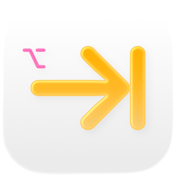

<div align="center">
  

  # OptionTab

  A native macOS window switcher. Press `Option+Tab` to see all windows of the frontmost app and raise the one you want — without ever leaving the keyboard.

  
  
  

  
</div>

## Why

macOS has no built-in way to switch between windows of the same app with just the keyboard — `⌘\`` cycles but skips minimized windows and doesn't show you what you're switching to. OptionTab fixes that: one keystroke, a focused list, no mouse.

## Features

- `Option+Tab` / `Option+Shift+Tab` global hotkey — forward and backward cycling
- Lists all windows from all Spaces, including minimized ones
- Minimized windows are marked and automatically unminimized on selection
- Translucent material UI — uses `.ultraThinMaterial` for a native macOS look (Liquid Glass on macOS 26)
- Menu bar utility — no Dock icon, zero footprint
- Launch at Login via `SMAppService`

## Requirements & Installation

macOS 14 (Sonoma) or later. No prebuilt release yet — build from source with Xcode 16+.

```bash
git clone https://github.com/andrealufino/optiontab.git
cd optiontab
cp Local.xcconfig.template Local.xcconfig
# edit Local.xcconfig and set DEVELOPMENT_TEAM = <your-10-char-team-id>
open optiontab.xcodeproj
```

Then build and run with `⌘R`.

## Usage

1. Launch OptionTab — it lives in the menu bar
2. Press `Option+Tab` while any app is frontmost
3. Cycle with `Tab` / `Shift+Tab` or `↓` / `↑`
4. Release `Option` to raise the selected window
5. `Esc` or click outside to cancel

## Permissions

OptionTab requires **Accessibility** access to read window titles, raise and unminimize windows, and listen for global key events. Screen Recording is not required.

A guided onboarding prompt appears on first launch.

## Contributing

Pull requests and issues are welcome. Please target the `develop` branch.

The project uses Swift 6 strict concurrency and zero third-party dependencies — keep it that way. Before opening a PR, make sure the build is clean (`⌘B` in Xcode or `xcodebuild` from the command line).

Maintainers: see [release.md](release.md) for the full release workflow.

## License

MIT — see [LICENSE](LICENSE).
